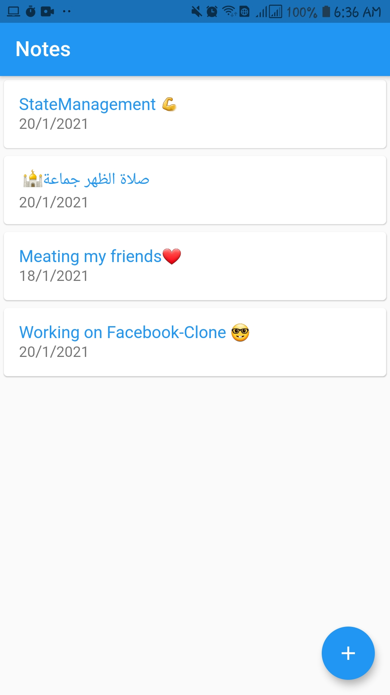

# flutter_notes_api
An application to create, update, and delete online notes using this api 
https://tq-notes-api-jkrgrdggbq-el.a.run.app/swagger/index.html

## Getting Started

This project is a starting point for a Flutter application.

A few resources to get you started if this is your first Flutter project:

- [Lab: Write your first Flutter app](https://flutter.dev/docs/get-started/codelab)
- [Cookbook: Useful Flutter samples](https://flutter.dev/docs/cookbook)

For help getting started with Flutter, view our
[online documentation](https://flutter.dev/docs), which offers tutorials,
samples, guidance on mobile development, and a full API reference.

# Screen shots: 
---

 

 

 

 

 

